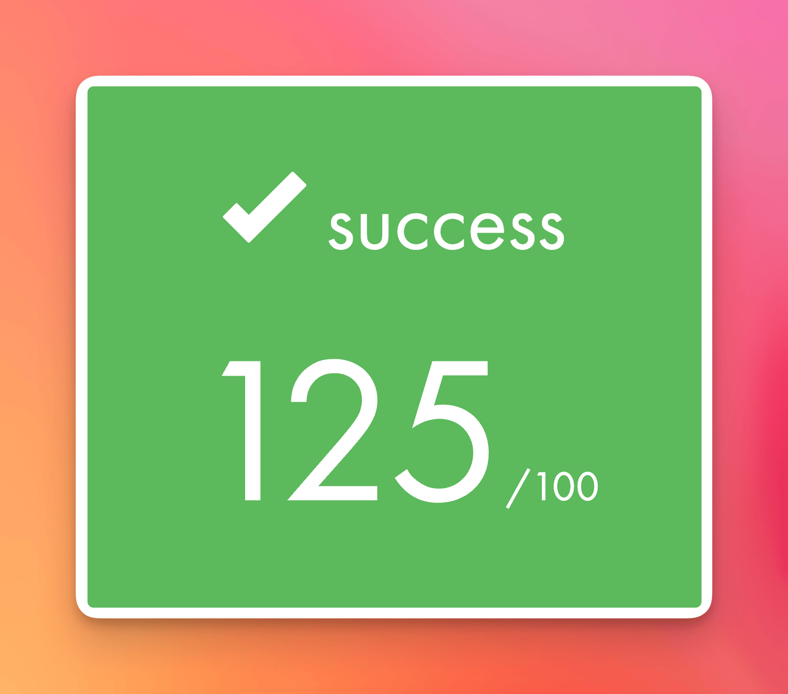

# 📚 Libft: My Custom C Library
A recreation of standard C library functions, along with additional utility functions and a linked list API.
This is the first project in the 42 school curriculum.
I started this project while waiting for 42's admission decision after my piscine.
That gave Libft a special meaning for me, and I still feel strongly attached to what it represents in my journey.

[Technologies Used](#-technologies-used) • [Features](#-features) • [The Process](#-the-process) • [What I Learned](#-what-i-learned) • [How It Could Be Improved](#-how-it-could-be-improved) • [How to Run the Project](#-how-to-run-the-project)



## 🛠️ Technologies Used
- `C`
- `Makefile`

## ✨ Features
This library provides a wide range of essential functionalities that act as a foundation for larger C projects:
- **Memory Manipulation:** `ft_memset`, `ft_bzero`, `ft_memcpy`, `ft_memmove`, `ft_calloc`, etc.
- **String Operations:** `ft_strlen`, `ft_strchr`, `ft_strncmp`, `ft_strnstr`, `ft_strdup`, `ft_split`, etc.
- **Type Utilities:** `ft_isalpha`, `ft_isdigit`, `ft_isalnum`, `ft_toupper`, `ft_itoa`, `ft_atoi`, etc.
- **File Descriptors:** `ft_putchar_fd`, `ft_putstr_fd`, `ft_putnbr_fd`, etc.
- **Linked Lists (Bonus):** `ft_lstnew`, `ft_lstadd_front`, `ft_lstsize`, `ft_lstmap`, etc.

**Example (`ft_split`)**
```c
char **words = ft_split("libft makes C easier", ' ');
if (!words)
    return (1);

for (int i = 0; words[i]; i++)
    printf("%s\n", words[i]);
```
> This shows how `ft_split` can quickly tokenize a sentence into reusable words.

## 🧑🏻‍🍳 The Process
I built this library by relying almost entirely on `man` pages to reproduce the exact behavior of standard C functions. Every function was written from scratch with no external dependencies beyond `malloc`, `free`, and `read`/`write`, which forced me to understand each edge case in depth.

As the project grew, the main challenge was making each function both reliable and reusable. I put strong emphasis on defensive coding, especially around invalid inputs and `NULL` pointers, to avoid segmentation faults. At the same time, I kept the code modular so functions could be safely composed and reused across the library without unnecessary complexity or performance trade-offs.

## 📚 What I Learned
Working on Libft gave me a much stronger grasp of **memory architecture**, especially the difference between stack and heap, **pointer arithmetic**, and careful allocation tracking to prevent leaks.

It also improved my **build automation** skills through practical use of `Makefiles`, from compiling object files to producing a reusable static `.a` library with clean build targets.

Finally, following strict standards like the 42 *Norminette* strengthened my approach to **clean code**: writing functions that are concise, readable, and consistently structured.

## 💭 How It Could Be Improved

* **Header Documentation:** Adding Doxygen-style comments in `libft.h` would improve IntelliSense/autocomplete and make the public API easier to understand at a glance.

* **Optimized Memory Transfers:** Current memory functions copy byte-by-byte. This could be drastically improved by casting to larger data types (like `unsigned long`) and moving blocks of 8 bytes at a time where possible.

## 🚦 How to Run the Project

1. **Clone the repository:**
    ```bash
    git clone https://github.com/Bonnet2B1/Libft.git
    cd Libft
    ```

2. **Compile the library:**
    ```bash
    make
    ```
    *To include the linked list bonus functions, run:*
    ```bash
    make bonus
    ```

3. **Use it in your projects:**
    Include the header in your `.c` files:
    ```c
    #include "libft.h"
    ```
    Then compile your program with the generated static library:
    ```bash
    gcc main.c -L. -lft -o my_program
    ```
